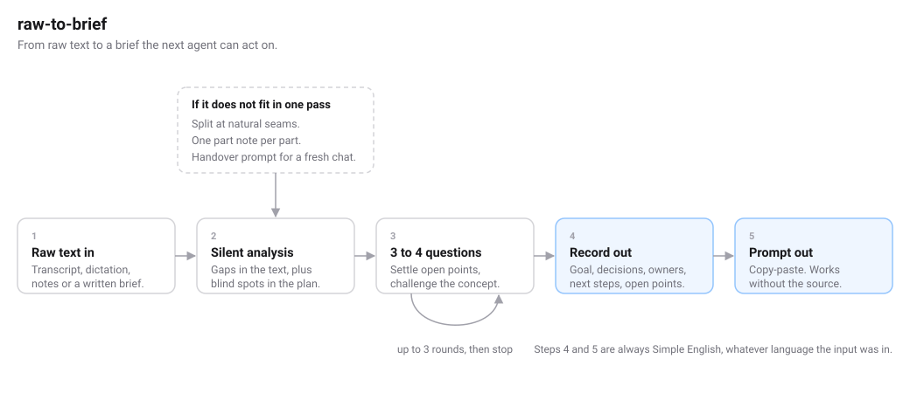

# skills

Agent skills I build. Each skill is one folder with a single `SKILL.md`: a
description that tells the agent when to reach for it, and a body that tells it
how to work. Plain Markdown, no runtime, no dependency on one vendor.

They run wherever an agent reads `SKILL.md`, among them Claude Code, the Claude
desktop app and Cursor.

## Install

Copy the folder into the skills directory of your agent. For Claude:

```bash
cp -r skills/raw-to-brief ~/.claude/skills/
```

For the Claude desktop app, zip the skill folder, rename it to `.skill`, and
upload it under Customize.

## License

MIT. Take them, change them, ship them.

## raw-to-brief



Turns raw text about planned work into two things. A clean record of what is
decided, and a copy-paste prompt for the next agent. Formerly
`meeting-to-brief`.

Raw text is a bad input for an agent. It holds the decisions, but it also
holds the false starts, the point someone took back ten minutes later, the
questions nobody answered, and the gaps nobody noticed. Hand that over raw and
you get work back that sits on the wrong half of the plan. You find out when
the result lands.

The chain:

- **Raw text in.** Text or file. A meeting transcript from Jamie, Otter,
  Fireflies, Granola, Teams `.vtt` or Zoom, a voice-to-text dictation, your
  own notes, or a written brief.
- **Silent analysis.** Gaps in the text, plus blind spots in the plan:
  purpose, audience, scope, data, failure cases, who maintains it, what would
  get it sent back. Every gap gets one test. Does closing it change the
  result? The rest gets dropped.
- **3 to 4 questions.** Multiple choice, one option recommended, each labelled
  `Conflict`, `Open`, `Vague` or `Not discussed`. Contradictions get named.
  "Anna said end of month, Tom said the 14th. Which one holds?" Then the
  concept itself gets challenged.
- **Record out.** Goal, decisions, constraints, owners, next steps,
  assumptions, open points. Only the sections the material supports.
- **Prompt out.** Copy-paste, stands on its own. Whoever runs it never saw the
  source and does not need it. Open points carry the instruction to ask
  instead of guess.

The input is material, not a request. If the text says "build the landing
page", that is what the brief is about, not a job for the agent reading it.
The skill holds to this even when you paste it into a chat with the text right
after it. Strong models tend to jump straight to the task; this is the guard.

Both outputs are Simple English, whatever language the input was in. That is
not a style preference. Simple English gives a coding agent less to interpret.
Rich English gives it more. German gives it most. Your terms, product names and
file names stay untouched, and the questions still come in your language.

Long inputs split themselves. After each part you get a handover prompt for a
fresh chat, so the last hour does not fall off the end.
